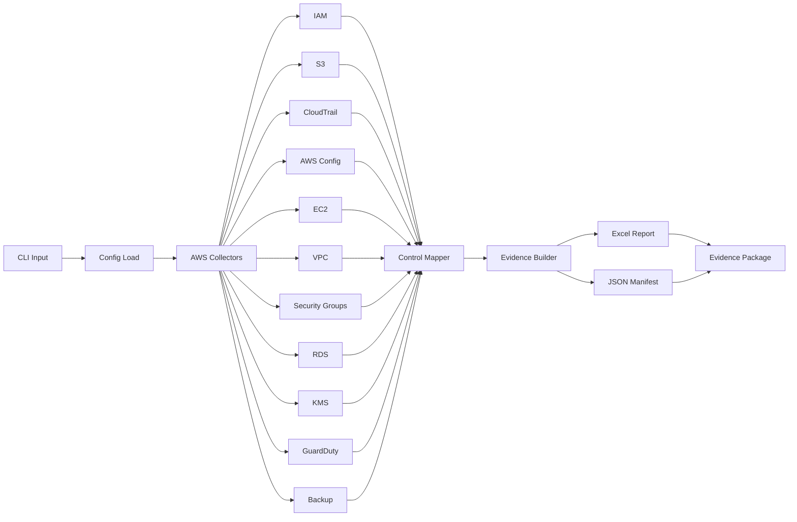

# compliance-harvester

> Map once. Comply twice. One AWS run to satisfy both SOC 2 and GDPR auditors.

[](https://www.python.org/)
[](https://opensource.org/licenses/MIT)
[](https://github.com/webber/compliance-harvester)
[](https://aws.amazon.com/boto3/)
[](https://aws.amazon.com/compliance/)

```
╔══════════════════════════════════════════════════════════════════════════════╗
║                                                                              ║
║   ██████╗  ██████╗ ████████╗██████╗  ██████╗ ██╗     ███████╗               ║
║   ██╔══██╗██╔═══██╗╚══██╔══╝██╔══██╗██╔═══██╗██║     ██╔════╝               ║
║   ██████╔╝██║   ██║   ██║   ██████╔╝██║   ██║██║     █████╗                 ║
║   ██╔══██╗██║   ██║   ██║   ██╔══██╗██║   ██║██║     ██╔══╝                 ║
║   ██████╔╝╚██████╔╝   ██║   ██████╔╝╚██████╔╝███████╗███████╗               ║
║   ╚═════╝  ╚═════╝    ╚═╝   ╚═════╝  ╚═════╝ ╚══════╝╚══════╝               ║
║                                                                              ║
║      ██████╗ ███████╗██╗    ██╗██╗     ███████╗███████╗                    ║
║      ██╔══██╗██╔════╝██║    ██║██║     ██╔════╝██╔════╝                    ║
║      ██║  ██║█████╗  ██║ █╗ ██║██║     █████╗  ███████╗                    ║
║      ██║  ██║██╔══╝  ██║███╗██║██║     ██╔══╝  ╚════██║                    ║
║      ██████╔╝███████╗╚███╔███╔╝███████╗███████╗███████║                    ║
║      ╚═════╝ ╚══════╝ ╚══╝╚══╝ ╚══════╝╚══════╝╚══════╝                    ║
║                                                                              ║
║   Automated AWS evidence collection for SOC 2 & GDPR compliance audits      ║
║                                                                              ║
╚══════════════════════════════════════════════════════════════════════════════╝
```

---

## The Problem

Compliance evidence collection is painful for SaaS companies preparing for audits.

A startup preparing for both SOC 2 Type II and GDPR audit faces weeks of manual evidence gathering across two separate frameworks — often by the same engineer, duplicating effort. They screenshot console configurations, export JSON manually, and try to align findings across two different control frameworks. It's tedious, error-prone, and expensive.

> **The bottom line:** Most companies end up doing the same technical checks twice — once mapped to SOC 2, once mapped to GDPR — because no tooling existed to unify them.

### Before vs. After

| Without This Tool | With compliance-harvester |
|-------------------|---------------------------|
| 2 separate audit processes | 1 automated run |
| Manual screenshots | Timestamped JSON evidence |
| Days of engineer time | Minutes |
| Inconsistent formatting | Auditor-ready Excel package |
| Duplicated evidence gathering | Map once, comply twice |

---

## How It Works

The tool runs a single collection pass against your AWS environment, automatically mapping each finding to both SOC 2 Trust Service Criteria and GDPR Article 32 requirements.



When you run the tool, it connects to your AWS account using read-only API calls, collects security configurations across multiple AWS services, applies the dual control mapping, and outputs a structured evidence package ready for auditors.

---

## Supported AWS Services & Controls

### Currently Automated (28+ Controls)

| Service | Controls | SOC 2 Criteria |
|---------|----------|-----------------|
| **IAM** | MFA enabled, password policy, unused credentials, root account MFA | CC6.1, CC6.3, CC6.7 |
| **S3** | Default encryption, public access block, bucket policy, versioning, access logging | CC6.7, CC6.8, CC7.2, CC7.3 |
| **CloudTrail** | Trail enabled, multi-region, log validation, encryption | CC6.7, CC6.8, CC7.2, CC7.3, CC7.4 |
| **AWS Config** | Config enabled, compliance status | CC7.2, CC7.3, CC7.4 |
| **EC2** | Instance profile, SSH key usage, VPC association, termination protection | CC6.1, CC6.6, CC6.7 |
| **VPC** | Flow logs, subnet public access, NAT gateway, route tables | CC6.6, CC7.2 |
| **Security Groups** | Unrestricted SSH, unrestricted RDP, overly permissive rules | CC6.6, CC6.7 |
| **RDS** | Encryption at rest, backup retention, multi-AZ, public access, deletion protection | CC6.7, CC6.8, CC7.5 |
| **KMS** | Key rotation, key policy, key usage | CC6.7, CC6.8 |
| **GuardDuty** | Detector enabled, findings, admin account | CC7.1, CC7.2 |
| **Backup** | Backup vaults, backup plans, recovery point retention | CC7.5 |

---

## Evidence Package Output

The tool generates a structured output folder ready for auditor review:

```
evidence-output/
├── raw/
│   ├── iam.json              # Full IAM API responses
│   ├── s3.json              # Full S3 API responses
│   ├── cloudtrail.json       # Full CloudTrail API responses
│   ├── config.json           # Full AWS Config responses
│   ├── ec2.json             # Full EC2 API responses
│   ├── vpc.json             # Full VPC API responses
│   ├── security_groups.json  # Full Security Group responses
│   ├── rds.json             # Full RDS API responses
│   ├── kms.json             # Full KMS API responses
│   ├── guardduty.json       # Full GuardDuty API responses
│   └── backup.json          # Full Backup API responses
├── report.xlsx              # Excel workbook with findings
└── manifest.json            # Run metadata and summary
```

### Output File Guide

| File | Who Uses It | Purpose |
|------|-------------|---------|
| `raw/*.json` | Engineer | Raw evidence, debugging |
| `report.xlsx` | Auditor | Human-readable findings by framework |
| `manifest.json` | Engineer + Auditor | Machine-readable metadata, automation |

---

## Technical Specifications

### Architecture Overview

The tool uses a modular collector pattern with clear separation of concerns:

```
compliance-harvester/
├── collect.py              # CLI entry point with argparse
├── config.yaml             # AWS configuration (profile, region, output)
├── mappings.py             # SOC 2 ↔ GDPR control definitions
├── collectors/
│   ├── iam.py             # IAM: MFA, password policy, credentials
│   ├── s3.py              # S3: encryption, access, policies
│   ├── cloudtrail.py      # CloudTrail: logging, validation
│   ├── config.py          # AWS Config: compliance rules
│   ├── ec2.py             # EC2: instances, security, VPC
│   ├── vpc.py             # VPC: flow logs, subnets, NAT
│   ├── security_groups.py # Security groups: firewall rules
│   ├── rds.py             # RDS: encryption, backups, multi-AZ
│   ├── kms.py             # KMS: key rotation, policies
│   ├── guardduty.py       # GuardDuty: threat detection
│   ├── backup.py          # AWS Backup: vault, plans
│   └── manual_evidence.py # Manual evidence import
├── reporters/
│   ├── excel.py           # openpyxl workbook generation
│   └── manifest.py        # JSON metadata builder
└── policy.json            # Minimum IAM permissions
```

### Dependencies

| Package | Version | Purpose |
|---------|---------|---------|
| `boto3` | >=1.26 | AWS SDK for Python |
| `pyyaml` | >=6.0 | Configuration file parsing |
| `openpyxl` | >=3.0 | Excel workbook generation |

### AWS Services & API Calls

The tool makes **read-only** API calls to these services:

| Service | API Calls Made | Purpose |
|---------|---------------|---------|
| **IAM** | `ListUsers`, `ListMfaDevices`, `GetAccountPasswordPolicy`, `ListAccessKeys`, `GetUser`, `GetAccessKeyLastUsed` | User security, credential lifecycle |
| **S3** | `ListBuckets`, `GetBucketEncryption`, `GetPublicAccessBlock`, `GetBucketPolicy`, `GetBucketVersioning`, `GetBucketLogging` | Data protection configuration |
| **CloudTrail** | `DescribeTrails`, `GetTrailStatus` | Audit logging coverage |
| **AWS Config** | `DescribeConfigurationRecorders`, `DescribeConfigRules`, `GetComplianceSummaryByConfigRule` | Compliance monitoring |
| **EC2** | `DescribeInstances`, `DescribeInstanceAttribute`, `DescribeSecurityGroups` | Instance security |
| **VPC** | `DescribeVpcs`, `DescribeFlowLogs`, `DescribeSubnets`, `DescribeNatGateways`, `DescribeRouteTables` | Network configuration |
| **Security Groups** | `DescribeSecurityGroups`, `DescribeSecurityGroupRules` | Firewall rules |
| **RDS** | `DescribeDbInstances`, `DescribeDbSubnetGroups`, `DescribeDbParameterGroups` | Database security |
| **KMS** | `ListKeys`, `GetKeyRotationStatus`, `GetKeyPolicy` | Key management |
| **GuardDuty** | `ListDetectors`, `GetDetector`, `GetFindingsStatistics` | Threat detection |
| **Backup** | `ListBackupVaults`, `ListBackupPlans`, `ListRecoveryPoints` | Backup configuration |
| **STS** | `GetCallerIdentity` | Account identification |

---

## Minimum IAM Permissions

> **Note:** This is a read-only policy. The tool cannot create, modify, or delete any AWS resource.

```json
{
  "Version": "2012-10-17",
  "Statement": [
    {
      "Sid": "IAMReadOnly",
      "Effect": "Allow",
      "Action": [
        "iam:ListUsers",
        "iam:ListMfaDevices",
        "iam:GetAccountPasswordPolicy",
        "iam:ListAccessKeys",
        "iam:GetUser",
        "iam:GetAccountSummary",
        "iam:GetAccessKeyLastUsed"
      ],
      "Resource": "*"
    },
    {
      "Sid": "S3ReadOnly",
      "Effect": "Allow",
      "Action": [
        "s3:ListAllMyBuckets",
        "s3:GetBucketEncryption",
        "s3:GetPublicAccessBlock",
        "s3:GetBucketPolicy",
        "s3:GetBucketVersioning",
        "s3:GetBucketLogging"
      ],
      "Resource": "arn:aws:s3:::*"
    },
    {
      "Sid": "CloudTrailReadOnly",
      "Effect": "Allow",
      "Action": [
        "cloudtrail:DescribeTrails",
        "cloudtrail:GetTrailStatus"
      ],
      "Resource": "*"
    },
    {
      "Sid": "ConfigReadOnly",
      "Effect": "Allow",
      "Action": [
        "config:DescribeConfigurationRecorders",
        "config:DescribeDeliveryChannels",
        "config:DescribeConfigRules",
        "config:GetComplianceSummaryByConfigRule"
      ],
      "Resource": "*"
    },
    {
      "Sid": "EC2ReadOnly",
      "Effect": "Allow",
      "Action": [
        "ec2:DescribeInstances",
        "ec2:DescribeInstanceAttribute",
        "ec2:DescribeSecurityGroups",
        "ec2:DescribeVpcs",
        "ec2:DescribeSubnets"
      ],
      "Resource": "*"
    },
    {
      "Sid": "VPCReadOnly",
      "Effect": "Allow",
      "Action": [
        "ec2:DescribeVpcs",
        "ec2:DescribeFlowLogs",
        "ec2:DescribeSubnets",
        "ec2:DescribeNatGateways",
        "ec2:DescribeRouteTables"
      ],
      "Resource": "*"
    },
    {
      "Sid": "RDSReadOnly",
      "Effect": "Allow",
      "Action": [
        "rds:DescribeDbInstances",
        "rds:DescribeDbSubnetGroups",
        "rds:DescribeDbParameterGroups"
      ],
      "Resource": "*"
    },
    {
      "Sid": "KMSReadOnly",
      "Effect": "Allow",
      "Action": [
        "kms:ListKeys",
        "kms:GetKeyRotationStatus",
        "kms:GetKeyPolicy",
        "kms:DescribeKey"
      ],
      "Resource": "*"
    },
    {
      "Sid": "GuardDutyReadOnly",
      "Effect": "Allow",
      "Action": [
        "guardduty:ListDetectors",
        "guardduty:GetDetector",
        "guardduty:GetFindingsStatistics"
      ],
      "Resource": "*"
    },
    {
      "Sid": "BackupReadOnly",
      "Effect": "Allow",
      "Action": [
        "backup:ListBackupVaults",
        "backup:ListBackupPlans",
        "backup:ListRecoveryPoints"
      ],
      "Resource": "*"
    },
    {
      "Sid": "STSReadOnly",
      "Effect": "Allow",
      "Action": ["sts:GetCallerIdentity"],
      "Resource": "*"
    }
  ]
}
```

---

## Security First

This tool is designed with security as the top priority.

- **Read-only by default.** Every AWS call is read-only. The tool cannot create, modify, or delete any resource.
- **No credentials stored.** Uses AWS profile from local environment or `.aws/credentials`.
- **No data exfiltration.** All evidence stays local — nothing is sent to external servers.
- **Evidence is local files only.** Output goes to your specified directory, not to any cloud storage.

> **This tool requires zero write permissions to your AWS environment. It cannot create, modify, or delete any resource.**

---

## CLI Usage

### Quick Start in 3 Steps

1. **Install dependencies:**
   ```bash
   pip install boto3 pyyaml openpyxl
   ```

2. **Configure AWS credentials:**
   ```bash
   aws configure --profile compliance
   ```

3. **Run the tool:**
   ```bash
   python collect.py --profile compliance --region us-east-1 --output ./evidence
   ```

### Usage Examples

```bash
# Full collection with all collectors
python collect.py --profile default --region us-east-1 --output ./evidence-output

# Run specific collectors only (faster for focused audits)
python collect.py --checks iam,s3,kms --output ./iam-s3-evidence

# Dry run - preview what would be collected (no AWS calls)
python collect.py --dry-run

# Custom configuration file
python collect.py --config prod-config.yaml

# Adjust credential inactivity threshold
python collect.py --inactive-days 60
```

### Available Collectors

| Collector | Description |
|-----------|-------------|
| `iam` | IAM user security, MFA, password policy |
| `s3` | S3 bucket encryption, access, policies |
| `cloudtrail` | CloudTrail logging configuration |
| `config` | AWS Config compliance monitoring |
| `ec2` | EC2 instance security |
| `vpc` | VPC flow logs, subnets, NAT gateways |
| `security_groups` | Security group firewall rules |
| `rds` | RDS database encryption, backups |
| `kms` | KMS key rotation, policies |
| `guardduty` | GuardDuty threat detection |
| `backup` | AWS Backup configurations |
| `manual` | Manual evidence import |

### CLI Options Reference

| Flag | Description | Default |
|------|-------------|---------|
| `--profile` | AWS credentials profile name | `default` |
| `--region` | AWS region to query | `us-east-1` |
| `--output` | Output directory for evidence | `./evidence-output` |
| `--config` | Custom config file path | `config.yaml` |
| `--checks` | Comma-separated collectors to run | All collectors |
| `--dry-run` | Preview without making AWS calls | `false` |
| `--inactive-days` | Credential age threshold | `90` |

---

## Sample Output

The Excel workbook contains findings grouped by service with:
- Check ID and description
- PASS/FAIL/MANUAL_REVIEW status
- SOC 2 criteria mapping
- GDPR Article 32 mapping
- Severity level
- Remediation recommendation

> **Note:** See the `/sample-output` folder for a full pre-generated evidence package using anonymized data. You can review exactly what the tool produces without running it against your own AWS account.

---

## Roadmap

- [x] IAM, S3, CloudTrail collectors
- [x] EC2, VPC, Security Groups collectors
- [x] RDS, KMS collectors
- [x] GuardDuty, Backup collectors
- [x] Manual evidence import
- [x] SOC 2 + GDPR dual mapping (28+ controls)
- [x] Excel + JSON output with recommendations
- [ ] Azure support (SOC 2 + GDPR)
- [ ] GCP support
- [ ] Slack/email alert on FAIL findings
- [ ] CI/CD pipeline integration (GitHub Actions example)

---

## Author & Contact

**Anand Sundar**  
[](https://github.com/anandsundar)
[](https://linkedin.com/in/anandsundar96)

Backend engineer specializing in cloud infrastructure, security automation, and compliance tooling.
