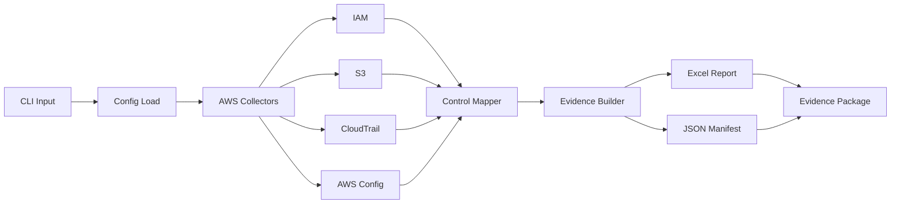

# compliance-harvester

> Map once. Comply twice. One AWS run to satisfy both SOC 2 and GDPR auditors.

[](https://www.python.org/)
[](https://opensource.org/licenses/MIT)
[](https://github.com/webber/compliance-harvester)
[](https://aws.amazon.com/boto3/)
[](https://aws.amazon.com/compliance/)

```
╔══════════════════════════════════════════════════════════════════════════════╗
║                                                                              ║
║   ██████╗  ██████╗ ████████╗██████╗  ██████╗ ██╗     ███████╗               ║
║   ██╔══██╗██╔═══██╗╚══██╔══╝██╔══██╗██╔═══██╗██║     ██╔════╝               ║
║   ██████╔╝██║   ██║   ██║   ██████╔╝██║   ██║██║     █████╗                 ║
║   ██╔══██╗██║   ██║   ██║   ██╔══██╗██║   ██║██║     ██╔══╝                 ║
║   ██████╔╝╚██████╔╝   ██║   ██████╔╝╚██████╔╝███████╗███████╗               ║
║   ╚═════╝  ╚═════╝    ╚═╝   ╚═════╝  ╚═════╝ ╚══════╝╚══════╝               ║
║                                                                              ║
║      ██████╗ ███████╗██╗    ██╗██╗     ███████╗███████╗                    ║
║      ██╔══██╗██╔════╝██║    ██║██║     ██╔════╝██╔════╝                    ║
║      ██║  ██║█████╗  ██║ █╗ ██║██║     █████╗  ███████╗                    ║
║      ██║  ██║██╔══╝  ██║███╗██║██║     ██╔══╝  ╚════██║                    ║
║      ██████╔╝███████╗╚███╔███╔╝███████╗███████╗███████║                    ║
║      ╚═════╝ ╚══════╝ ╚══╝╚══╝ ╚══════╝╚══════╝╚══════╝                    ║
║                                                                              ║
║   Automated AWS evidence collection for SOC 2 & GDPR compliance audits      ║
║                                                                              ║
╚══════════════════════════════════════════════════════════════════════════════╝
```

---

## The Problem

Compliance evidence collection is painful for SaaS companies preparing for audits.

A startup preparing for both SOC 2 Type II and GDPR audit faces weeks of manual evidence gathering across two separate frameworks — often by the same engineer, duplicating effort. They screenshot console configurations, export JSON manually, and try to align findings across two different control frameworks. It's tedious, error-prone, and expensive.

> **The bottom line:** Most companies end up doing the same technical checks twice — once mapped to SOC 2, once mapped to GDPR — because no tooling existed to unify them.

### Before vs. After

| Without This Tool | With compliance-harvester |
|-------------------|---------------------------|
| 2 separate audit processes | 1 automated run |
| Manual screenshots | Timestamped JSON evidence |
| Days of engineer time | Minutes |
| Inconsistent formatting | Auditor-ready Excel package |
| Duplicated evidence gathering | Map once, comply twice |

---

## How It Works

The tool runs a single collection pass against your AWS environment, automatically mapping each finding to both SOC 2 Trust Service Criteria and GDPR Article 32 requirements.



When you run the tool, it connects to your AWS account using read-only API calls, collects security configurations across IAM, S3, CloudTrail, and AWS Config, applies the dual control mapping, and outputs a structured evidence package ready for auditors.

---

## SOC 2 ↔ GDPR Control Mapping

This is the core differentiator. Each automated check maps to both frameworks simultaneously, eliminating duplicated effort.

| Check | What It Verifies | SOC 2 Criterion | GDPR Article 32 | Severity |
|-------|-----------------|-----------------|-----------------|----------|
| MFA Enabled | All users require two-factor login | CC6.1, CC6.7 | Art. 32(1)(b) | 🔴 HIGH |
| Password Policy Strength | Minimum 8 chars, complexity requirements | CC6.1, CC6.3 | Art. 32(1)(b) | 🔴 HIGH |
| Password Expiry | Passwords rotate within 90 days | CC6.1, CC6.3 | Art. 32(1)(b) | 🟡 MEDIUM |
| Unused Credentials | Keys unused >90 days flagged | CC6.1, CC6.7 | Art. 32(1)(b) | 🟡 MEDIUM |
| Root Account MFA | Emergency access protected | CC6.1, CC6.7 | Art. 32(1)(b), (d) | 🔴 HIGH |
| S3 Default Encryption | Data at rest encrypted by default | CC6.7, CC6.8 | Art. 32(1)(a) | 🔴 HIGH |
| S3 Public Access Block | Buckets protected from public access | CC6.1, CC6.7 | Art. 32(1)(b) | 🔴 HIGH |
| S3 Versioning | Object versioning enabled for durability | CC6.7, CC6.8 | Art. 32(1)(c) | 🟡 MEDIUM |
| CloudTrail Enabled | API activity logging active | CC7.2, CC7.3 | Art. 32(1)(d) | 🔴 HIGH |
| CloudTrail Multi-Region | Logging covers all regions | CC7.2, CC7.3 | Art. 32(1)(d) | 🔴 HIGH |
| CloudTrail Log Validation | Log file integrity verified | CC7.2, CC7.3, CC7.4 | Art. 32(1)(c), (d) | 🔴 HIGH |
| AWS Config Rules | Compliance monitoring active | CC7.2, CC7.3 | Art. 32(1)(d) | 🟡 MEDIUM |

---

## Evidence Package Output

The tool generates a structured output folder ready for auditor review:

```
evidence-package-2026-03-04-210500/
├── raw/
│   ├── iam.json           # Full IAM API responses
│   ├── s3.json            # Full S3 API responses
│   ├── cloudtrail.json    # Full CloudTrail API responses
│   └── config.json        # Full AWS Config responses
├── report.xlsx            # Excel workbook with 3 sheets
└── manifest.json          # Run metadata and summary
```

### Sample manifest.json Snippet

```json
{
  "manifest_version": "1.0",
  "tool_info": {
    "name": "compliance-harvester",
    "version": "1.0.0"
  },
  "run_metadata": {
    "timestamp": "2026-03-04T21:05:00Z",
    "aws_account_id": "123456789012",
    "region": "us-east-1"
  },
  "summary": {
    "total_checks": 28,
    "pass_count": 22,
    "fail_count": 4,
    "manual_review_count": 2,
    "pass_rate": 78.57
  }
}
```

### Output File Guide

| File | Who Uses It | Purpose |
|------|-------------|---------|
| `raw/*.json` | Engineer | Raw evidence, debugging |
| `report.xlsx` | Auditor | Human-readable findings by framework |
| `manifest.json` | Engineer + Auditor | Machine-readable metadata, automation |

---

## Technical Specifications

### Architecture Overview

The tool uses a modular collector pattern with clear separation of concerns:

```
compliance-harvester/
├── collect.py              # CLI entry point with argparse
├── config.yaml             # AWS configuration (profile, region, output)
├── mappings.py             # SOC 2 ↔ GDPR control definitions
├── collectors/
│   ├── iam.py             # IAM: MFA, password policy, credentials
│   ├── s3.py              # S3: encryption, access, policies
│   ├── cloudtrail.py      # CloudTrail: logging, validation
│   └── config.py          # AWS Config: compliance rules
├── reporters/
│   ├── excel.py           # openpyxl workbook generation
│   └── manifest.py        # JSON metadata builder
└── policy.json            # Minimum IAM permissions
```

### Dependencies

| Package | Version | Purpose |
|---------|---------|---------|
| `boto3` | >=1.26 | AWS SDK for Python |
| `pyyaml` | >=6.0 | Configuration file parsing |
| `openpyxl` | >=3.0 | Excel workbook generation |

### AWS Services & API Calls

The tool makes **read-only** API calls to these services:

| Service | API Calls Made | Purpose |
|---------|---------------|---------|
| **IAM** | `ListUsers`, `ListMfaDevices`, `GetAccountPasswordPolicy`, `ListAccessKeys`, `GetUser` | User security, credential lifecycle |
| **S3** | `ListBuckets`, `GetBucketEncryption`, `GetPublicAccessBlock`, `GetBucketPolicy`, `GetBucketVersioning`, `GetBucketLogging` | Data protection configuration |
| **CloudTrail** | `DescribeTrails`, `GetTrailStatus`, `GetEventSelectors` | Audit logging coverage |
| **AWS Config** | `DescribeConfigurationRecorders`, `DescribeConfigRules`, `GetComplianceSummaryByConfigRule` | Compliance monitoring |
| **STS** | `GetCallerIdentity` | Account identification |

---

## Minimum IAM Permissions

> **Note:** This is a read-only policy. The tool cannot create, modify, or delete any AWS resource.

```json
{
  "Version": "2012-10-17",
  "Statement": [
    {
      "Sid": "IAMReadOnly",
      "Effect": "Allow",
      "Action": [
        "iam:ListUsers",
        "iam:ListMfaDevices",
        "iam:GetAccountPasswordPolicy",
        "iam:ListAccessKeys",
        "iam:GetUser",
        "iam:GetAccountSummary"
      ],
      "Resource": "*"
    },
    {
      "Sid": "S3ReadOnly",
      "Effect": "Allow",
      "Action": [
        "s3:ListAllMyBuckets",
        "s3:GetBucketEncryption",
        "s3:GetPublicAccessBlock",
        "s3:GetBucketPolicy",
        "s3:GetBucketVersioning",
        "s3:GetBucketLogging"
      ],
      "Resource": "arn:aws:s3:::*"
    },
    {
      "Sid": "CloudTrailReadOnly",
      "Effect": "Allow",
      "Action": [
        "cloudtrail:DescribeTrails",
        "cloudtrail:GetTrailStatus",
        "cloudtrail:GetEventSelectors"
      ],
      "Resource": "*"
    },
    {
      "Sid": "ConfigReadOnly",
      "Effect": "Allow",
      "Action": [
        "config:DescribeConfigurationRecorders",
        "config:DescribeDeliveryChannels",
        "config:DescribeConfigRules",
        "config:GetComplianceSummaryByConfigRule"
      ],
      "Resource": "*"
    },
    {
      "Sid": "STSReadOnly",
      "Effect": "Allow",
      "Action": ["sts:GetCallerIdentity"],
      "Resource": "*"
    }
  ]
}
```

---

## Security First

This tool is designed with security as the top priority.

- **Read-only by default.** Every AWS call is read-only. The tool cannot create, modify, or delete any resource.
- **No credentials stored.** Uses AWS profile from local environment or `.aws/credentials`.
- **No data exfiltration.** All evidence stays local — nothing is sent to external servers.
- **Evidence is local files only.** Output goes to your specified directory, not to any cloud storage.

> **This tool requires zero write permissions to your AWS environment. It cannot create, modify, or delete any resource.**

---

## CLI Usage

### Quick Start in 3 Steps

1. **Install dependencies:**
   ```bash
   pip install boto3 pyyaml openpyxl
   ```

2. **Configure AWS credentials:**
   ```bash
   aws configure --profile compliance
   ```

3. **Run the tool:**
   ```bash
   python collect.py --profile compliance --region us-east-1 --output ./evidence
   ```

### Usage Examples

```bash
# Full collection with all collectors
python collect.py --profile default --region us-east-1 --output ./evidence-output

# Dry run - preview what would be collected (no AWS calls)
python collect.py --dry-run

# Run specific collectors only (faster for focused audits)
python collect.py --checks iam,s3 --output ./iam-s3-evidence

# Custom configuration file
python collect.py --config prod-config.yaml

# Adjust credential inactivity threshold
python collect.py --inactive-days 60
```

### CLI Options Reference

| Flag | Description | Default |
|------|-------------|---------|
| `--profile` | AWS credentials profile name | `default` |
| `--region` | AWS region to query | `us-east-1` |
| `--output` | Output directory for evidence | `./evidence-output` |
| `--config` | Custom config file path | `config.yaml` |
| `--checks` | Comma-separated collectors to run | `iam,s3,cloudtrail,config` |
| `--dry-run` | Preview without making AWS calls | `false` |
| `--inactive-days` | Credential age threshold | `90` |

---

## Sample Output

> 

The Excel workbook contains three sheets:

1. **Summary** — Overall pass/fail counts by service
2. **SOC2** — All findings grouped by Trust Service Criterion
3. **GDPR** — All findings grouped by Article 32 sub-requirement

> **Note:** See the `/sample-output` folder for a full pre-generated evidence package using anonymized data. You can review exactly what the tool produces without running it against your own AWS account.

---

## Why I Built This

I've spent years watching engineering teams grind through compliance audits — the same engineers manually collecting evidence, taking screenshots, exporting JSON, and doing the same work twice because no tooling unified SOC 2 and GDPR evidence collection.

I built compliance-harvester to solve that exact problem. The insight was simple: the underlying AWS configurations are the same regardless of which framework you're mapping to. MFA is MFA. S3 encryption is S3 encryption. The only difference is the label auditors expect to see.

This tool demonstrates a few things I care about as an engineer: practical automation over theoretical frameworks, clean code with proper documentation, and solving real problems with minimal complexity. It also shows how to design systems that are read-only by default — a principle more tooling should follow.

If your team is navigating SOC 2 or GDPR and spending engineering time on manual evidence collection, I'd love to talk.

---

## Roadmap

- [x] IAM, S3, CloudTrail collectors
- [x] SOC 2 + GDPR dual mapping
- [x] Excel + JSON output
- [ ] AWS Config deep integration
- [ ] Azure support (SOC 2 + GDPR)
- [ ] Slack/email alert on FAIL findings
- [ ] CI/CD pipeline integration (GitHub Actions example)

---

## Author & Contact

**Anand Sundar**  
[](https://github.com/anandsundar)
[](https://linkedin.com/in/anandsundar96)

Backend engineer specializing in cloud infrastructure, security automation, and compliance tooling.
